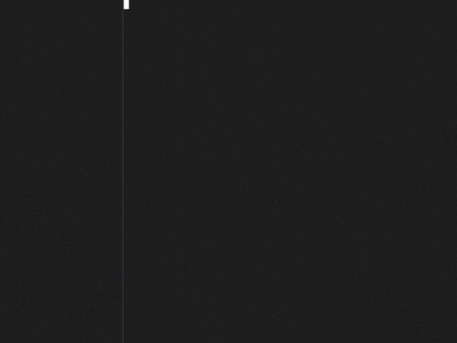

## Cellular Automata in Ruby 
Collection of implementations for [cellular automata](https://en.wikipedia.org/wiki/Cellular_automaton) in Ruby 

## [Conway's Game of Life](https://en.wikipedia.org/wiki/Conway%27s_Game_of_Life)

```console
$ ruby gol.rb
```
<div align="center">
  
  
</div>

## [Rule 110](https://en.wikipedia.org/wiki/Rule_110)
```console
$ ruby rule110.rb
```
<div align="center">
  
</div>

## [Rule 22](https://arxiv.org/pdf/2005.01480.pdf#:~:text=Rule%2022%20elementary%20cellular%20automaton,function%20of%20three%20cell%20states.)
```console 
$ ruby rule22.rb
```
<div align="center">
  
</div>


